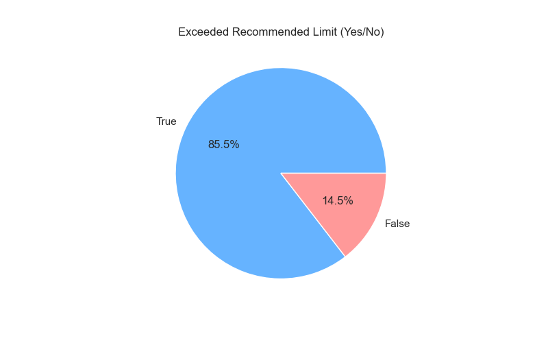
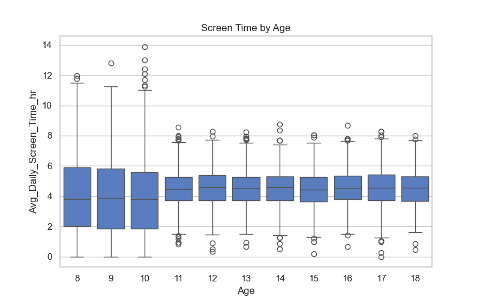
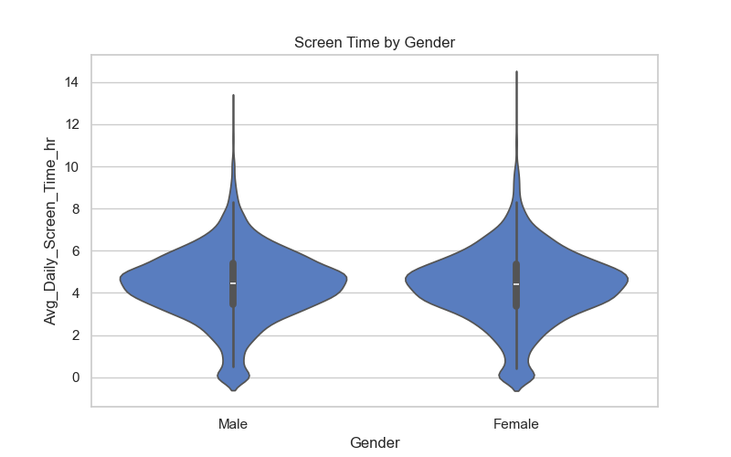
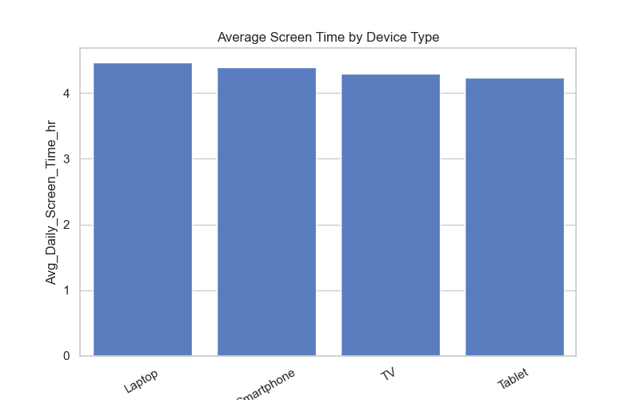
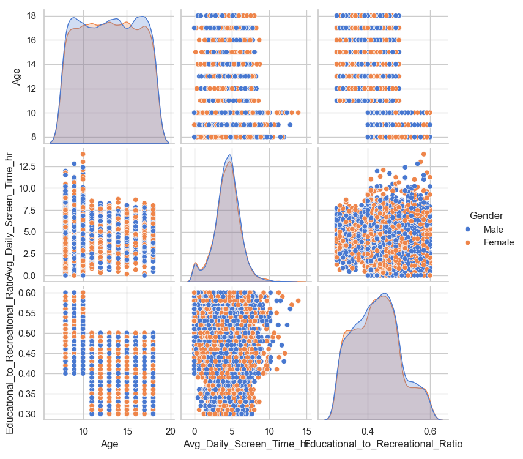
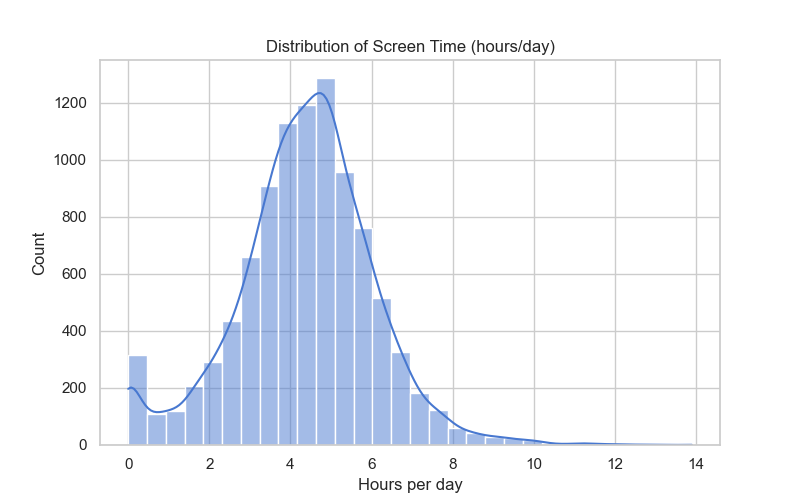

# 📊 Indian Kids Screentime 2025 – Data Visualization Project

## 📂 Project Overview
This project explores the **screen time habits of Indian kids in 2025** using an open-source dataset.  
The dataset contains information such as age, gender, average daily screen time, primary devices used, whether screen time exceeded the recommended limit, educational vs recreational usage ratio, health impacts, and urban/rural lifestyle.  

The goal is to use **Seaborn** and **Matplotlib** to visualize the data, gain insights, and present them clearly.  

---

## 📑 Dataset Description
Each row in the dataset represents a child’s screen time profile with the following features:

- **Age** – Age of the child  
- **Gender** – Male or Female  
- **Avg_Daily_Screen_Time_hr** – Average screen time in hours  
- **Primary_Device** – Main device used (Smartphone, Laptop, TV, etc.)  
- **Exceeded_Recommended_Limit** – Whether daily usage exceeded healthy limits  
- **Educational_to_Recreational_Ratio** – Ratio of educational to recreational screen use  
- **Health_Impacts** – Reported effects (Poor Sleep, Eye Strain, Anxiety, etc.)  
- **Urban_or_Rural** – Lifestyle background  

---

## 📸 Visualizations

Here are some of the plots created during the analysis:

1. **Pie Chart** –   
   
   

2. **Box Plot** –  
   

3. **Box Plot + Strip Plot** –   
   

4. **Violin Plot** –  
   

5. **Bar Plot** –   
   

6. **Count Plot** –  
   

7. **Pair Plot** –   
   

8. **Histogram Plot** –  
   

---

## 🔎 Insights from the Data
- **Smartphones** are the most commonly used devices among kids, followed by laptops and TVs.  
- **Teenagers (8–14)** generally have higher screen time compared to other kids.  
- **Females** in this dataset show slightly higher average screen time than males.  
- A majority of kids **exceed recommended screen limits**, raising health concerns.  
- **Poor sleep and eye strain** are the most common health issues linked to screen usage.  
- Kids from **urban areas** show higher screen time than those in rural areas.  
- A low **educational-to-recreational ratio** suggests most screen time is used for entertainment rather than learning.  

---

## 🚀 How to Run the Project
1. Clone the repository:  
   ```bash
   git clone https://github.com/your-username/indian-kids-screentime-2025.git
